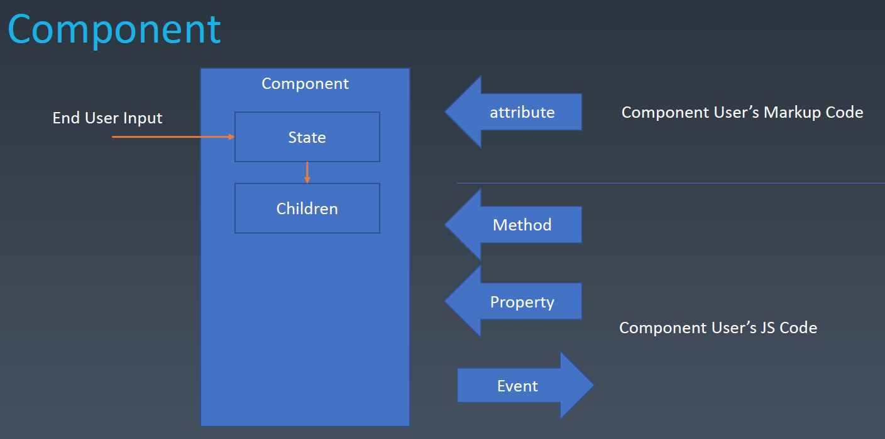
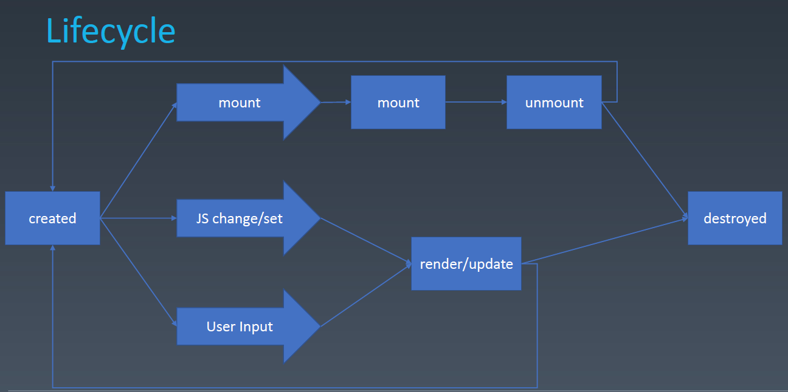

# 组件化

前端架构主要包含架构模式和组件化。使用声明式的方式更能直观得写代码。组件化就是设计能用声明式方式（比如 HTML）写组件的方式。

## 实现方式

当前，组件化的实现方式主要有两种：

1. class 形式
2. hooks 形式

## 组成

组件一般用对象来抽象表示。对象的组成包括：

- Properties
- Methods
- Inherit

组件在对象的基础上，额外增加了：

- Attributes
- Config
- State
- Event
- Lifecycle
- Children



## Attributes 和 Properties 的比较

Attributes 强调描述性。一般使用标记语言（HTML 等）、模板语言（JSX 等）表示。一般的，我们可以把它当作 property 的默认值。当然，就像 JavaScript 可以操纵 DOM 一样， Attribute 也可以使用 JavaScript 来操纵。伪代码为：

```javascript
<myComponent a="v" />;
myComponent.setAttribute("a", "value");
myComponent.getAttribute("a");
```

Properties 强调从属关系。一般使用 JavaScript 来操纵。一般的，页面上展示的是 property 的内容。伪代码为：

```javascript
<myComponent a="v" />;
myComponent.a = "value";
```

Attributes 和 Properties 可以保持一致，也可以保持不一致，由具体 API 层面决定。

```html
<input value="cute" />

<script>
  let input = document.getElementsByTagName("input")[0];
  input.value; // cute 访问 property
  input.getAttribute("value"); // cute 访问 attribute

  input.value = "hello"; // 更改 property。注意，这里并不会去更改 attribute
  input.value; // hello 访问 property
  input.getAttribute("value"); // cute 访问 attribute
</script>
```

在 React 的 API 中，采用了保持一致的设计思路。

## 如何设计组件状态

|           | Markup Set | JavaScript Set | JavaScript Change | User Input Change |
| --------- | ---------- | -------------- | ----------------- | ----------------- |
| property  | ×          | √              | √                 | ?                 |
| attribute | √          | √              | √                 | ?                 |
| state     | ×          | ×              | ×                 | √                 |
| config    | ×          | √              | ×                 | ×                 |

## Lifecycle



## children

children 分为 Content 型和 Template 型。

```javascript
// Content 型
<my-button>>{{title}}</my-button>

// Template 型。下图中，使用data-xxx 生成多个 li
<my-list data-xxx>
    <li>>{title}}
</my-list>
```

## webpack 和 babel

webpack 用于打包 web 资源，使浏览器能调用 web 资源。babel 将新的 JavaScript 语法转化为浏览器可识别的语法。

## JSX

JSX 是 Facebook 发明的类 XML 的 ECMA Script 扩展。它不一定要结合 React 使用，可以单独拿出来给开发者使用。

## webpack-dev-server

webpack-dev-server 是一款实时热加载工具，减少了用户在开发过程中反复手动打命令编译的烦恼。
